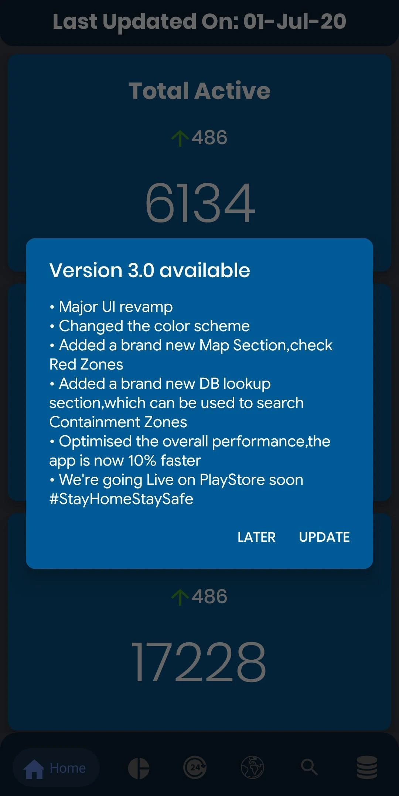
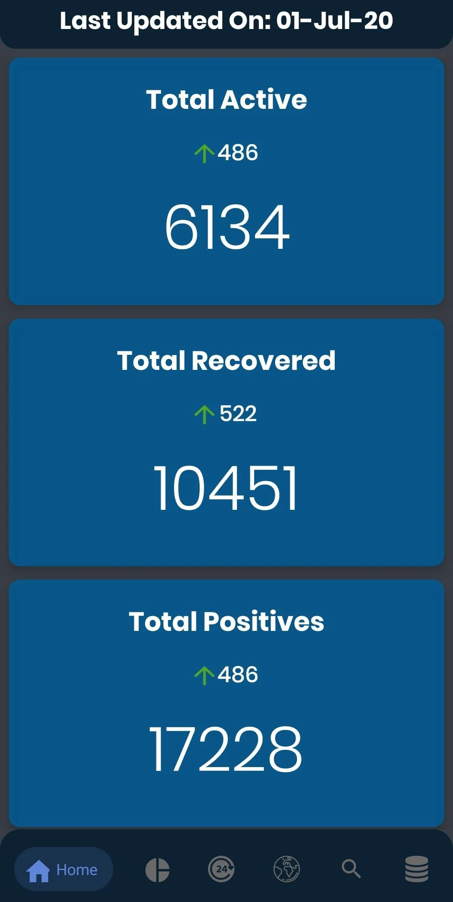
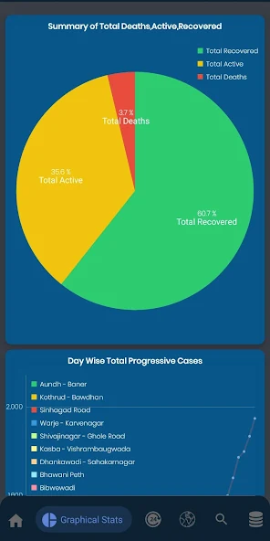
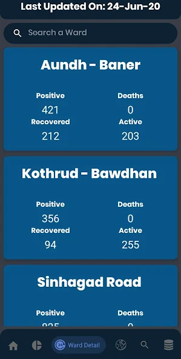
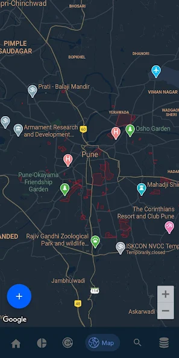

# PCT

PCT is Pune Corona Tracker. It was born out of boredom during the COVID-19 pandemic and is one of my first well-designed (visually) and though of projects.
As I mentioned, it was born out of boredom, but also out of need.
The problem I tried to solve was tracking of **Ward level data**, which was really difficult to get at that time, because everyone was focused on national level or wider regions were being targed

So, the interesting part was, to get the data, and for this, I utilised the csv file, which I used to update daily, by going to various sources, like Twitter, the Municipal Corporation's Mayor's Social Media Handles
This has also been open sourced now, and is [here](https://github.com/ForceGT/PCTApi). It was a tedious process, but yeah, I could kill my time fruitfully

Post, all of this hard work, I deployed it to the Google Play Store , and got about 500 users, and all seemed
pretty interested in the app, but as COVID-19 went away, obviously the app had to die, but let's praise the hero

## Downloads

## Screenshots

  
  
  
  
  

## Features

- Access ward level data, cumulatively
- Options to access the data graphically, and daily updation
- Map with red zones ( Deprecated now, due to lack of data )
- In app updates, with a custom [json](https://github.com/ForceGT/pct_api/blob/master/update_info.json) deployed to netlify 

## For the devs

There's nothing much for an Android dev, except the fact that we learn, and I'm happy to see myself grow, because I'm absolutely disgusted at the code I have written
in this, but anyway, this is just an exhibition of growth for me. I don't plan to refactor it, neither should you
